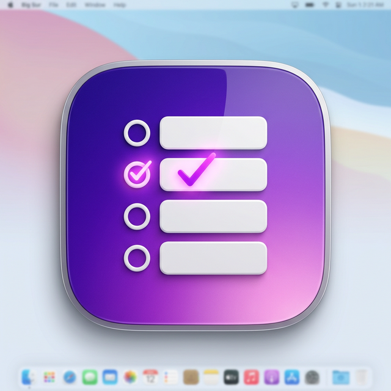

# 📝 TinyTodo



TinyTodo 是一款专为 macOS 设计的极简轻量级桌面待办事项应用。基于 Electron 构建，采用原生级别的前端技术（原生 HTML/CSS/JS）打造。它完全抛弃了笨重的前端框架与复杂的依赖，力求启动最快、体积最小。

项目拥有深度契合 macOS 审美的人机交互细节：从极致丝滑的 CSS 列表排序动画，到完美融合 macOS 全局配置的底层毛玻璃（Vibrancy）质感材质界面。希望它能成为你桌面上最安静优雅的效率助手。

## ✨ 核心特性

- **极致轻量**：无冗余的 React/Vue 框架负担，由纯粹的 Vanilla JS 极速驱动。
- **系统级融合**：深浅色双模式无缝切换，连底层的窗体毛玻璃特效也与 CSS 主题完美联调反色。
- **无边框原生质感**：沉浸式窗体设计，高度复刻 Apple HIG 设计规范的间距与排版。
- **全局置顶**：点击图钉 📌 按钮，让待办事项始终悬浮在桌面最前方，工作不分心。
- **丝滑交互**：任务新增、删除、完成等全方位涵盖流畅但不打扰的微动画过渡。
- **本地存储**：数据全盘本地化（无云端），保护隐私，断网也完全不影响使用。

## 🚀 快速开始

确保你的电脑上已经安装了 [Node.js](https://nodejs.org/)。

### 1. 克隆项目
```bash
git clone https://github.com/your-username/tinytodo.git
cd tinytodo
```

### 2. 安装依赖
```bash
npm install
```

### 3. 开发环境运行
```bash
npm start
```
*此命令将启动并在本地直接打开 TinyTodo 窗口进行调试预览。*

## 📦 打包与分发

如果希望打包出一份可以发给别人或者直接安装到本地“应用程序”中的 macOS 镜像盘（`.dmg`）：

```bash
npm run dist
```
*构建成功后，所有的安装包文件均会输出在根目录的 `dist/` 文件夹中。*

## 🛠 技术栈
- [Electron](https://www.electronjs.org/) (进程管理、原生系统 API 挂载)
- Vanilla Javascript (ES6+)
- 原生 CSS3 变量控制 + HTML5语义化标签

## 📄 开源协议
[MIT License](LICENSE)
